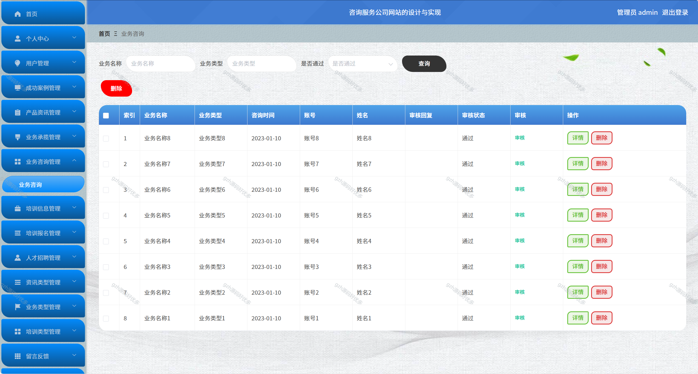

# python086
python086基于Python+Django的咨询服务公司网站+LW+PPT
 
## 查看主页获取源码

### 一、关键词
顾问服务公司网站，专业咨询服务网，行业咨询服务网站

### 二、作品包含
源码+数据库+设计文档万字+PPT+全套环境和工具资源+本地部署教程

### 三、项目技术
前端技术：Vue2.0、Element-ui
后端技术：Python3.7、Django2.0

### 四、运行环境（以下版本亲测，其他版本兼容性请自行测试）
开发工具：PyCharm + VSCODE

数据库：MySQL5.7（最低要5.7版本）

数据库管理工具：Navicat10+

Python：Python3.7

前端Nodejs：14

浏览器：谷歌浏览器

### 五、项目介绍
项目编号：python086

近些年来，随着科技的飞速发展，互联网的普及逐渐延伸到各行各业中，给人们生活带来了十分的便利，咨询服务公司网站利用计算机网络实现信息化管理，使整个咨询服务公司的发展和服务水平有显著提升。
系统拥有管理员和用户两个角色，主要具备注册登录、个人信息修改、用户信息、成功案例、产品资讯、业务承揽、业务咨询、培训信息、培训报名、人才招聘等功能模块。将纸质管理有效实现为在线管理，极大提高工作效率。

### 六、运行截图

